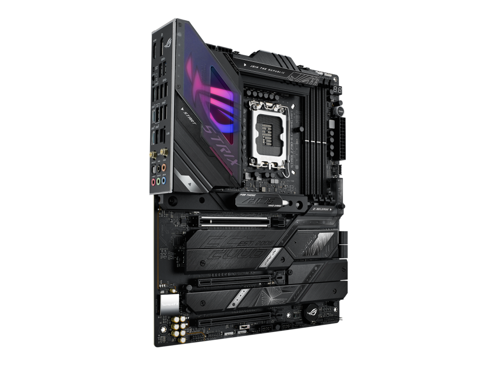

# :apple: Strix Z790-E + i7-14700KF + 6950 XT



**macOS**: Tahoe (26.1)<br>
**OpenCore**: 1.0.6 (release 2025-09-11)

Farewell to Hackintosh and thank you for all the work [Acidanthera](https://github.com/acidanthera)!
<br><br>
:white_check_mark: iMessage<br>
:white_check_mark: Continuity<br>
:ballot_box_with_check: AirDrop (Hackintosh-to-Device [one-way], "Allow me to be discovered by: Everyone" isn't letting me select it)<br>
:no_entry: Bluetooth (Turns on but drops connections)<br>
:white_check_mark: Wi-Fi (HeliPort)<br>
:white_check_mark: FileVault<br>
:white_check_mark: Sleep<br>
:white_check_mark: Power Management<br>
:white_check_mark: DRM Playback<br>
:white_check_mark: SSD TRIM<br>
:white_check_mark: CFG Lock Removed<br>
:white_check_mark: Audio (via built-in monitor speaker for now)<br>
:x: Boot Chime (Files/Settings are there, but finish when I have speakers)<br>
<br>

| Hardware | &nbsp; |
| --- | --- |
| Mobo     | ASUS ROG STRIX Z790-E Gaming WiFi (note: *not* version II)<br /><sup>Chipset: Z790, Ethernet: Intel I226-V, Wi-Fi: AX210, Audio: ALC4080</sup> |
| CPU      | Intel Core i7-14700KF (Raptor Lake Refresh)              |
| GPU      | PowerColor Red Devil AMD Radeon RX 6950 XT               |
| RAM      | 32GB Corsair Vengeance DDR5 6000MHz (2 x 16GB)           |
| SSD      | 2TB WD_BLACK SN850X NVMe                                 |
| BT/Wi-Fi | BCM94360CD (*Optional*: I have this card in case there is a way to support Bluetooth again. Wi-Fi is handled by the motherboard) |

<br>

**<ins>Benchmarks</ins>**
<br>
Scores comparing this Hackintosh vs. Mac Studio M4 Max 14-Core CPU/32-Core GPU:

| Cinebench       | Strix Z790-E | M4 Max |
| --------------- | ------------ | ------ |
| GPU<sup>**</sup>           | 7,943        | 16,574 |
| CPU Multi-Core  | 2,009    | 1,811  |
| CPU Single-Core | 129          | 186    |

<sup>**Cinebench GPU test seems to be far more optimized for Apple Silicon GPUs, see Geekbench scores below + Shadow of the Tomb Raider tests</sup>

| Geekbench       | Strix Z790-E | M4 Max  |
| --------------- | ------------ | ------- |
| CPU Single-Core | 2,922        | 4,038   |
| CPU Multi-Core  | 17,499       | 23,509  |
| GPU OpenCL      | 116,903  | 100,867 |
| GPU Metal       | 236,274  | 159,479 |

| Shadow of the Tomb Raider @ 1440p/Highest/No AA | Strix Z790-E | M4 Max |
| ----------------------------------------------- | ------------ | ------ |
| Low FPS                                         | 90       | 66     |
| Avg FPS                                         | 116      | 90     |

| AmorphousDiskMark | Strix Z790-E (Read) | M4 Max (Read) | Strix Z790-E (Write) | M4 Max (Write) |
| ------------------- | ------------------- | ------------- | -------------------- | -------------- |
| SEQ1M QD8           | 6,851.77      | 6,461.81      | 6,111.67             | 7,285.36       |
| SEQ1M QD1           | 4,670.55      | 3,342.05      | 4,934.23             | 7,322.58       |
| RND4K QD64          | 507.17              | 1,241.28      | 382.09         | 173.10         |
| RND4K QD1           | 80.47        | 59.30         | 461.29         | 32.37          |


<br><br>
**<ins>ASUS BIOS Settings</ins>**
<br><br>
Advanced<br>
&nbsp;&nbsp;&nbsp;&nbsp;CPU Configuration<br>
&nbsp;&nbsp;&nbsp;&nbsp;&nbsp;&nbsp;&nbsp;&nbsp;CPU - Power Management Control<br>
&nbsp;&nbsp;&nbsp;&nbsp;&nbsp;&nbsp;&nbsp;&nbsp;&nbsp;&nbsp;&nbsp;&nbsp;CPU C-States = `Enabled`<br>
&nbsp;&nbsp;&nbsp;&nbsp;Platform Misc Configuration<br>
&nbsp;&nbsp;&nbsp;&nbsp;&nbsp;&nbsp;&nbsp;&nbsp;Native ASPM = `Enabled`<br>
&nbsp;&nbsp;&nbsp;&nbsp;&nbsp;&nbsp;&nbsp;&nbsp;DMI ASPM = `Auto`<br>
&nbsp;&nbsp;&nbsp;&nbsp;&nbsp;&nbsp;&nbsp;&nbsp;DMI Gen3 ASPM = `Auto`<br>
&nbsp;&nbsp;&nbsp;&nbsp;&nbsp;&nbsp;&nbsp;&nbsp;PEG - ASPM = `L0sL1`<br>
&nbsp;&nbsp;&nbsp;&nbsp;PCH-FW Configuration<br>
&nbsp;&nbsp;&nbsp;&nbsp;&nbsp;&nbsp;&nbsp;&nbsp;PTT = `Enabled`<br>
&nbsp;&nbsp;&nbsp;&nbsp;Trusted Computing<br>
&nbsp;&nbsp;&nbsp;&nbsp;&nbsp;&nbsp;&nbsp;&nbsp;Security Device Support = `Disabled` (this is TPM)<br>
&nbsp;&nbsp;&nbsp;&nbsp;UEFI Variables Protection<br>
&nbsp;&nbsp;&nbsp;&nbsp;&nbsp;&nbsp;&nbsp;&nbsp;Password protection of Runtime Variables = `Disabled`<br>
Boot<br>
&nbsp;&nbsp;&nbsp;&nbsp;Fast Boot = `Disabled`<br>
&nbsp;&nbsp;&nbsp;&nbsp;Setup Mode = `Advanced Mode` (optional)<br>

<br>

**<ins>Important Notes</ins>**

- BIOS version ***must*** be 1801, anything beyond breaks the setup when ACPIs are trying to load
- CFG Lock command for `Modified GRUB Shell`:
  ```setup_var_cv CpuSetup 0x44 0x01 0x00```
- I originally had the Samsung 990 Pro NVMe, but faced issues dealing with mass files (even with `NVMeFix`), so I got the recommended WD_BLACK series
- If dual booting, select macOS as the startup disk via `System Settings` -> `General` -> `Startup Disk`
- Of course, HeliPort must be installed later for Wi-Fi

<br>

**<ins>TODO</ins>**
- Bluetooth via BCM94360CD card, if possible ([Possible Broadcom Fix for Tahoe](https://www.tonymacx86.com/threads/success-with-broadcom-bcm943602cdp-wifi-under-tahoe.332619/))<br>
- Speakers + Boot Chime<br>
- Make AirDrop two-way<br>
